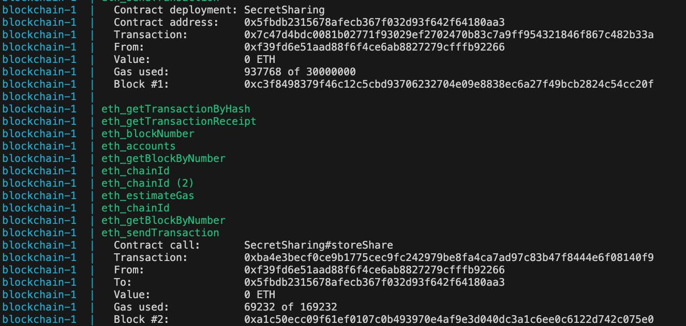
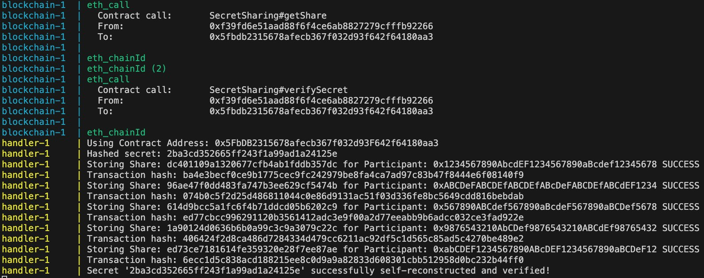
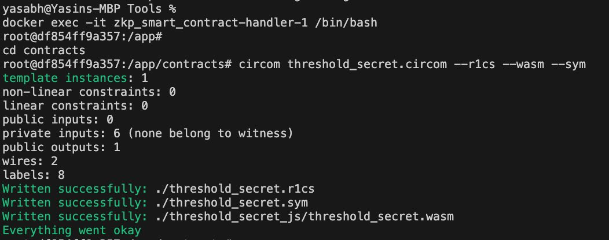
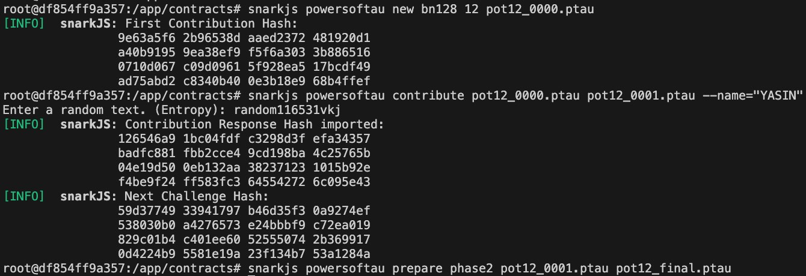
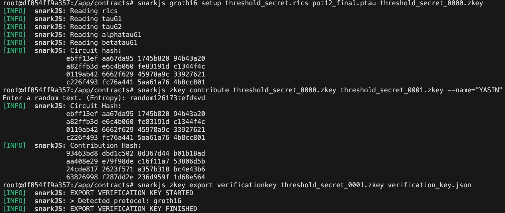
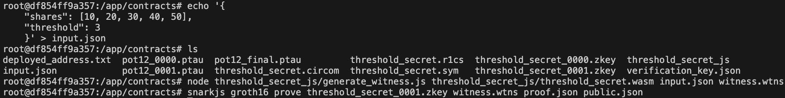
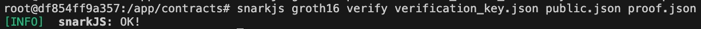
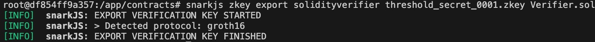

# a ZKP-based Smart Contract for Verifiable Threshold Secret Sharing on Ethereum EVM

## Example of Use Case
Think of a big company treasury on Ethereum that needs five directors to agree before moving any funds. They take the wallet’s secret key and split it into five pieces so that any three pieces can rebuild the key, but one or two pieces by themselves mean nothing. Each director sends their piece to a smart contract along with a proof that their piece is genuine—without ever revealing the piece itself. Once the contract checks and accepts three valid proofs, it safely unlocks the funds. Everyone can see on the blockchain that exactly three real proofs went through, no single director ever exposes the key, and no one can sneak in a fake piece.

## Shamir Secret Sharing
https://pycryptodome.readthedocs.io/en/latest/src/protocol/ss.html

# Run Outcome
Deployed Contract and Stored Shares


Secret Reconstructed and Verified


## Run inside the project file
```bash
docker compose up
```

## This should be done inside the "handler" container

```bash
docker exec -it zkp_smart_contract-handler-1 /bin/bash
cd contracts
```

### 1. Compile the Circuit
```bash
circom threshold_secret.circom --r1cs --wasm --sym
```


### 2. Trusted Setup
```bash
snarkjs powersoftau new bn128 12 pot12_0000.ptau
snarkjs powersoftau contribute pot12_0000.ptau pot12_0001.ptau --name="YASIN"
snarkjs powersoftau prepare phase2 pot12_0001.ptau pot12_final.ptau
```


### 3. Generate Proving and Verification Keys
```bash
snarkjs groth16 setup threshold_secret.r1cs pot12_final.ptau threshold_secret_0000.zkey
snarkjs zkey contribute threshold_secret_0000.zkey threshold_secret_0001.zkey --name="YASIN"
snarkjs zkey export verificationkey threshold_secret_0001.zkey verification_key.json
```


### 4. Proof Generation (Example)
1. Save inputs to `input.json`:
   ```bash
   echo '{
    "shares": [10, 20, 30, 40, 50],
    "threshold": 3
    }' > input.json
   ```
2. Generate witness and proof:
   ```bash
   node threshold_secret_js/generate_witness.js threshold_secret_js/threshold_secret.wasm input.json witness.wtns
   snarkjs groth16 prove threshold_secret_0001.zkey witness.wtns proof.json public.json
   ```


### 5. Verify Proof
```bash
snarkjs groth16 verify verification_key.json public.json proof.json
```


### 6. Export Solidity Verifier
```bash
snarkjs zkey export solidityverifier threshold_secret_0001.zkey Verifier.sol
exit
```


## Re-run inside the project file
Terminate the container firstly before re-running this:
```bash
docker compose up
```

### 6. Tools used

Hardhat: A development environment for compiling, deploying, testing, and debugging Ethereum smart contracts.
Ethers.js: A JavaScript library for interacting with Ethereum smart contracts.
Solidity: A programming language for writing the SecretSharingZKP contract.
Verifier.sol: A contract auto-generated by SnarkJS to verify ZKP proofs on-chain.
Circom: A ZKP circuit compiler for designing the mathematical logic to verify secret sharing.
SnarkJS: A library for ZKP operations, including generating proofs and verifier contracts.
PyCryptodome: Used for cryptographic operations:
Crypto.Protocol.SecretSharing for implementing Shamir’s Secret Sharing.
Crypto.Hash.SHA256 for securely hashing the secret.
Web3.py: For interacting with the Ethereum blockchain and the deployed smart contract.
Node.js: Required for running Hardhat and other JavaScript-based tools.
Linux Shell / Command Line: For executing Circom, SnarkJS, and Hardhat commands.
